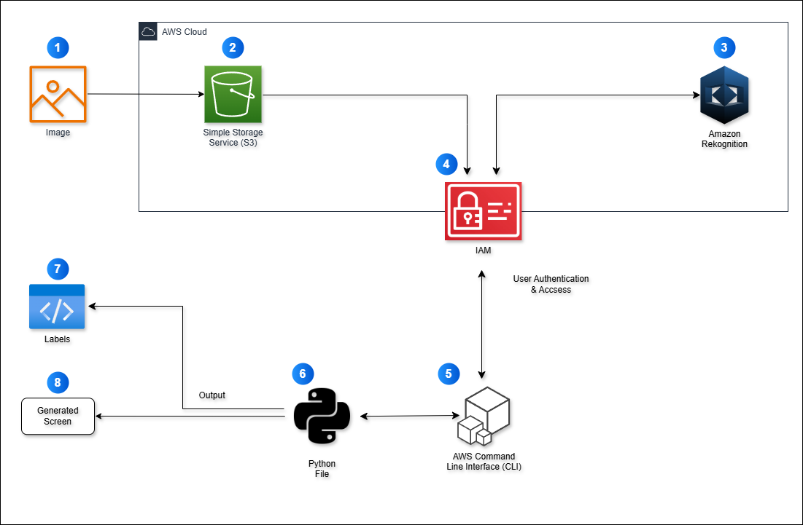
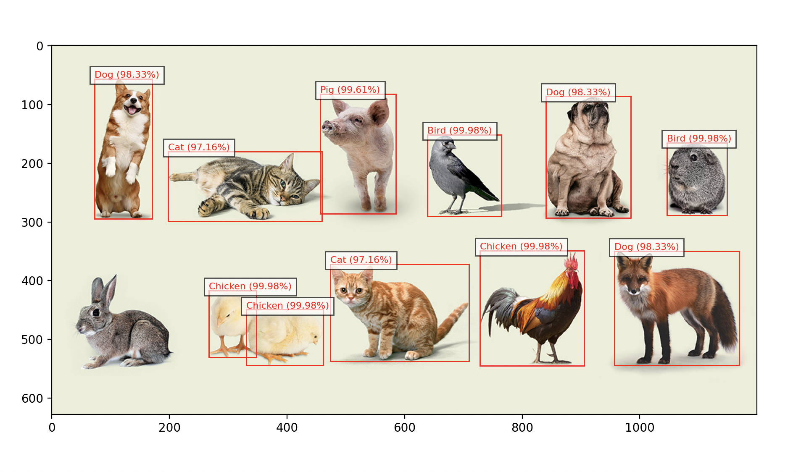
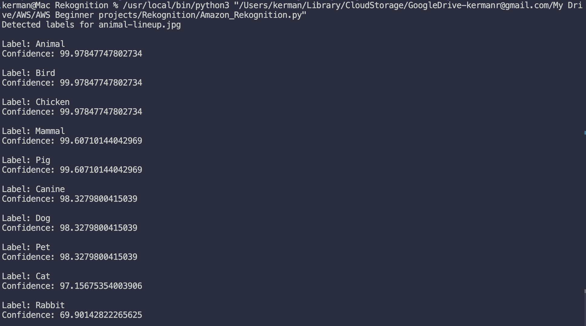
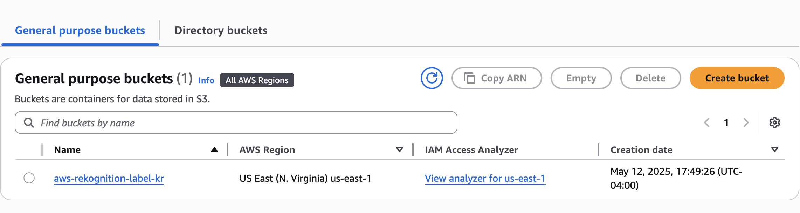

# 🖼️ Image Labels Generator with Amazon Rekognition

## 🔍 Overview of the Project

This project demonstrates how to use **Amazon Rekognition** to automatically detect and label objects within an image stored in an **Amazon S3 bucket**. The goal was to build a basic image analysis application that recognizes elements in a photo (e.g., detecting a cat in a photo and labeling it accordingly).

This was part of a hands-on cloud learning experience, and the project helped reinforce core AWS concepts like S3, Rekognition, and CLI integration.  

---

## 🛠️ Services Used

- **Amazon S3**: For storing uploaded images.
- **Amazon Rekognition**: For detecting and labeling content in the images.
- **AWS CLI**: To interact with AWS services from the terminal.
- **Boto3 (Python SDK)**: For building the script that interacts with Rekognition.

---

## 👩‍💻 Steps I Followed

1. **Created an S3 Bucket** to store the image file.
2. **Uploaded sample image(s)** to the S3 bucket.
3. **Installed and configured AWS CLI** on my local machine to interact with AWS from the terminal.
4. **Wrote Python script** using Boto3 that:
    - Authenticates with AWS
    - Calls `detect_labels()` from Rekognition
    - Displays labels and confidence levels
5. **Ran the script via VSCode terminal** and confirmed label detection worked correctly.
6. **Captured key screenshots and diagrams** to document the workflow and structure.

---

## 📸 Screenshots & Diagrams

### Architecture Diagram

---

### Labeled Output from Rekognition

---

### Script Running in VSCode

---

### S3 Bucket with Uploaded Image

---

## ⏱️ Time & Cost

- **Time Spent**: ~30 minutes
- **Cost**: Free under AWS Free Tier

---

## 🎓 What I Learned

- How to use **AWS Rekognition for image processing**
- Hands-on experience with **AWS CLI**
- Working with **Python Boto3 SDK**
- Fundamentals of **S3 storage and IAM configuration**
- Importance of proper **documentation and diagramming**

---

> This is the second of four beginner-level AWS projects I'm working on as part of the **Tech with Lucy** cloud journey. More to come soon.

